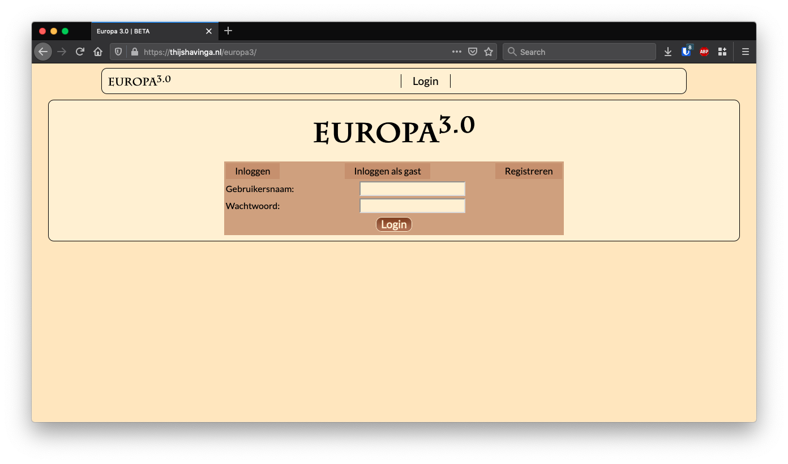

# Europa

"Europa" is the name I gave to a browsergame I built at highschool to play with friends. 

This turn based tactics game involves acquiring money by owning countries (and leveraging trade between own countries and those of trade partners) to build armies to defend and attack these countries. The name refers to the original playing map centered around the European continent. Later, I added more maps such as the world, the Netherlands and Westeros.

## First version

In the first verison, you would be greeted by the following login screen.

The interface of the game looked like this:

## Europa 2

The second version mostly entailed thorough refactoring and an interface renewal, including a neat splash screen for new visitors:

The interface resembles the orginal one, but with some improvements:

## Europa 3

The third version of the game I never finished. Again, the core motivation for the new version was refactoring, but also featured new interfaces:

